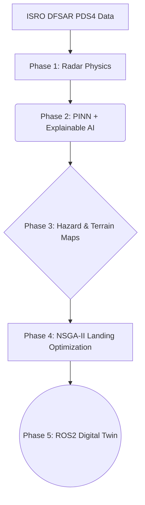

# LUNA-SITE: Autonomous Landing Intelligence & Lunar Digital Twin 🚀

[](https://hack2skill.com/event/bah2026/)
[](#)
[](https://www.python.org/downloads/)
[](https://pytorch.org/)
[](https://docs.ros.org/)

**LUNA-SITE** is an end-to-end, 21-layer intelligence architecture designed as a pre-mission planning pipeline for **Chandrayaan-4**. It processes raw ISRO DFSAR polarimetric radar data to detect subsurface water ice in Doubly Shadowed Craters (PSRs), maps terrain hazards, optimizes landing sites using NSGA-II, and validates rover traversal via a ROS2 Digital Twin.

---

## 🛰️ The Scientific Mission: Challenge 8

**The Objective:** Extract water ice from the Lunar South Pole's permanently shadowed regions.
**The Problem:** Optical sensors fail in 25K pitch-black craters (The Optical Paradox). Traditional neural networks act as black boxes, providing point estimates without physical uncertainty bounds.
**Our Solution:** We leverage Chandrayaan-2's **Dual Frequency Synthetic Aperture Radar (DFSAR)** to detect volumetric scattering caused by water ice crystals, processing the 4-channel Stokes Vectors through a Physics-Informed Neural Network (PINN).

### Scientific Validation
LUNA-SITE's baseline detection algorithms are validated against NASA mini-RF and Chandrayaan-2 DFSAR baseline readings from the **Faustini** and **Shackleton** doubly shadowed craters.

---

## 🏗️ The 21-Layer Architecture (5 Phases)

LUNA-SITE operates on a shared data contract tied to the **South Polar Stereographic Projection (EPSG:3031)**.



### Phase 1: PSR & Radar Ice Detection
- **Layer 0:** PDS4 Data Parsing (via `pds4_tools` to natively handle ISRO XML labels)
- **Layer 1-2:** PSR & Doubly Shadowed Crater Mapping via SPICE Toolkits
- **Layer 3:** CPR (>1) & DOP (<0.13) Target Detection
- **Layer 4-5:** Terrain Roughness Rejection & Kalman Smoothing

### Phase 2: Deep Learning & Uncertainty Bounds
- **Layer 6:** DeepSORT Spatio-Temporal Tracking across orbital passes
- **Layer 7:** CNN + Monte Carlo (MC) Dropout + Grad-CAM for Explainable AI
- **Layer 8:** PINN Depth Probability Bounds `L = λ / (4π × tan δ)`
- **Layer 9:** Ice Volume Estimation

### Phase 3: Hazard & Terrain Mapping
- **Layer 10:** Dual-Zone Hazard Mapping (Sunlit YOLOv8 + PSR Radar/DEM)
- **Layer 11-14:** Traversability, Illumination Calendars, Earth Visibility, and Excavation Priority. Enforces strict Chandrayaan-4 constraints (Slope < 10°, Boulders < 0.32m).

### Phase 4: Landing Site Optimization
- **Layer 15-16:** NSGA-II Multi-Objective Optimization to balance Ice Volume, Solar Energy, and Traverse Safety to compute a non-dominated Pareto Front.

### Phase 5: ROS2 Digital Twin Simulator
- **Layer 17-20:** Energy-aware RRT* global planning + DWA live obstacle avoidance. Validated in a Gazebo + ArduPilot simulator environment.

---

## 💻 Repository Structure

```text
LUNA_SITE_ISRO/
├── code/
│   ├── cnn_ice_detector.py           # Layer 7: PyTorch CNN + MC Dropout + Grad-CAM
│   ├── cpr_dop_mapper.py             # Layer 3: Radar Physics detection logic
│   ├── generate_synthetic_isro_data.py # Data generator for test bounds
│   ├── luna_site_dashboard.py        # Layer 19: Streamlit Mission Control UI
│   ├── lunar_dataset.py              # PyTorch DataLoader for DFSAR tensors
│   ├── nsga2_optimizer.py            # Layer 15: Landing Site Multi-Objective Optimizer
│   ├── requirements.txt              # Standard Python dependencies
│   ├── rrt_star_planner.py           # Layer 17: Energy-Aware RRT* Global Planner
│   ├── run_demo.py                   # Master Script: End-to-end pipeline execution
│   ├── train_cnn_pinn.py             # Layer 8: Physics-Informed Training loop
│   └── yolo_hazard_mapper.py         # Layer 10: Dual-Zone constraint switch
├── docker-compose.yml                # Docker compose for 1-click execution
├── Dockerfile                        # Dashboard container image
├── LUNA_SITE_FINALE.pptx             # Master Presentation Deck
└── README.md
```

## 🚀 How to Run the Project (Hackathon Finale)

We have containerized the Mission Control Dashboard to guarantee execution on any judge's machine without environment errors.

### 1. Pre-Compute the Demo Pipeline (Locally)
Run the master script to process the DFSAR data, execute the NSGA-II optimizer, and pre-compute the Mons Mouton RRT* path:
```bash
cd code
pip install -r requirements.txt
python run_demo.py
```

### 2. Launch the Mission Control Dashboard (via Docker)
Launch the interactive 6-mode Streamlit dashboard utilizing Docker Compose:
```bash
cd LUNA_SITE_ISRO
docker-compose up --build
```
*Navigate to `http://localhost:8501` to view the Lunar Digital Twin.*

## 🛡️ We Are Not Starting From Scratch
The core pathfinding and obstacle avoidance algorithms (RRT* and DWA) utilized in Phase 5 are directly adapted from our team's validated **Tactical Aerial Combat Simulator**, developed in MATLAB. We have successfully ported these high-speed drone collision avoidance algorithms to handle the slow, low-gravity terrain traversal of a lunar rover.

---
*Built for the ISRO Bharatiya Antariksh Hackathon 2026.*
